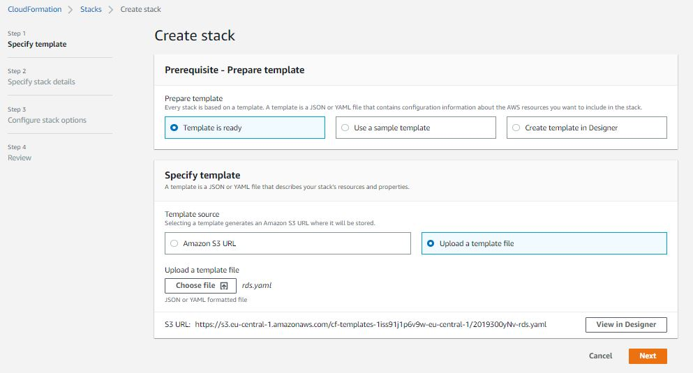
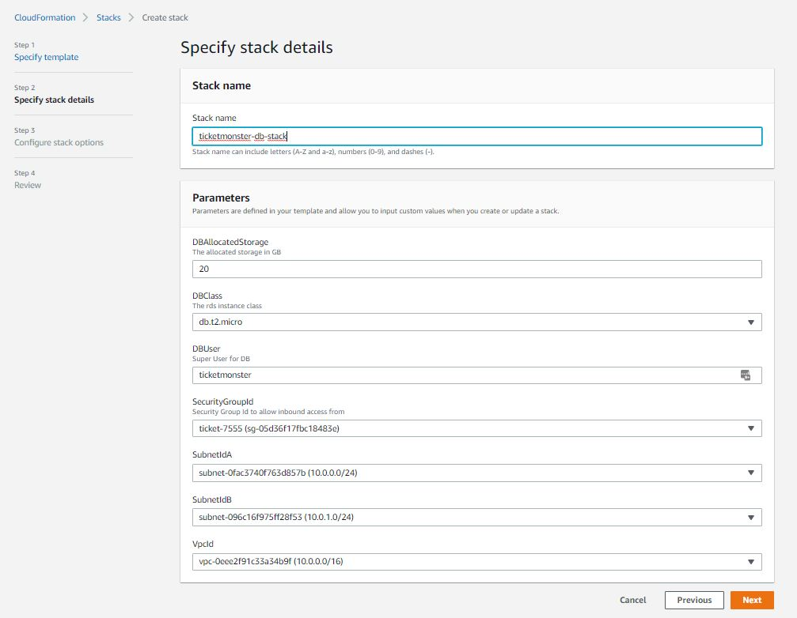

# CloudFormation

## Resources
- AWS::RDS::DBInstance https://docs.aws.amazon.com/AWSCloudFormation/latest/UserGuide/aws-properties-rds-database-instance.html
- AWS::EC2::SecurityGroup https://docs.aws.amazon.com/AWSCloudFormation/latest/UserGuide/aws-properties-ec2-security-group.html
- AWS::RDS::DBSubnetGroup https://docs.aws.amazon.com/AWSCloudFormation/latest/UserGuide/aws-resource-rds-dbsubnet-group.html

Fill Resource Properties:
## Template
```yaml
AWSTemplateFormatVersion: 2010-09-09

Parameters:
  VpcId:
    Type: AWS::EC2::VPC::Id
  SubnetIdA:
    Type: AWS::EC2::Subnet::Id
  SubnetIdB:
    Type: AWS::EC2::Subnet::Id
  SecurityGroupId:
    Type: AWS::EC2::SecurityGroup::Id
    Description: Security Group Id to allow inbound access from
  DBUser:
    Type: String
    Default: ticketmonster
    Description: Super User for DB
  DBPassword:
    Type: String
    Default: ticketmonster
    Description: password for super user
  DBClass:
    Type: String
    Default: db.t2.micro
    Description: The rds instance class
    AllowedValues: [ db.t2.micro, db.t2.small, db.t2.medium, db.t2.large, db.t2.xlarge, db.t2.2xlarge , db.m4.large, db.m4.xlarge, db.m4.2xlarge , db.m4.4xlarge , db.m4.10xlarge, db.m4.16xlarge, db.m3.medium, db.m3.large, db.m3.xlarge, db.m3.2xlarge , db.r3.large, db.r3.xlarge, db.r3.2xlarge , db.r3.4xlarge , db.r3.8xlarge , db.r4.large, db.r4.xlarge, db.r4.2xlarge , db.r4.4xlarge , db.r4.8xlarge , db.r4.16xlarge, db.m5.large , db.m5.xlarge, db.m5.2xlarge , db.m5.4xlarge, db.m5.12xlarge, db.m5.24xlarge ]
  DBAllocatedStorage:
    Type: String
    Default: 20
    Description: The allocated storage in GB

Resources:

  DBEC2SecurityGroup:
    Type: AWS::EC2::SecurityGroup
    Properties:


  DBSubnetGroup:
    Type: AWS::RDS::DBSubnetGroup
    Properties:


  DBInstance:
    Type: AWS::RDS::DBInstance
    Properties:
 
Outputs:
  StackName:
    Value: !Sub "${AWS::StackName}"
  DBEndpointAddress:
    Value: !GetAtt DBInstance.Endpoint.Address
    Export:
      Name: !Sub "${AWS::StackName}-DBEndpointAddress"
  DBEndpointPort:
    Value: !GetAtt DBInstance.Endpoint.Port
    Export:
      Name: !Sub "${AWS::StackName}-DBEndpointPort"
  DBPasswd:
    Value: !Ref DBPassword
    Export:
      Name: !Sub "${AWS::StackName}-DBPasswd"
  DBSuperUser:
    Value: !Ref DBUser
    Export:
      Name: !Sub "${AWS::StackName}-DBSuperUser"
  DBEC2SecurityGroup:
    Value: !Ref DBEC2SecurityGroup
    Export:
      Name: !Sub "${AWS::StackName}-DBEC2SecurityGroup"
```


## Launch CloudFormation Stack
1. Navigate to the AWS CloudFormation Console
1. Click *Create Stack*
1. Upload your CloudFormation template
    
1. Specify stack details
    
1. Skip stack options
1. Review and under Capabilities select *I acknowledge that AWS CloudFormation might create IAM resources.*
1. Click *Create Stack*
1. Review Stack Creation Events in the AWS CloudFormation Console