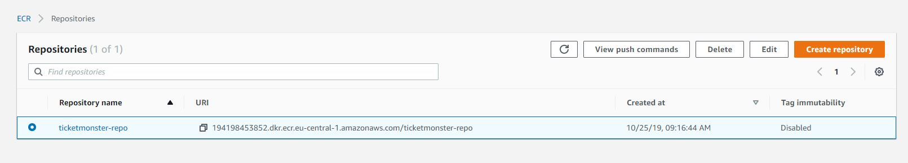

# Amazon Elastic Container Registry (ECR)
[Working phase 02.01]

## Push your image to Amazon Elastic Container Registry<a name="use-ecr"></a>

Amazon ECR is a managed AWS Docker registry service\. Customers can use the familiar Docker CLI to push, pull, and manage images\. For Amazon ECR product details, featured customer case studies, and FAQs, see the [Amazon Elastic Container Registry product detail pages](http://aws.amazon.com/ecr)\.


**To tag your image and push it to Amazon ECR**

1. Create an Amazon ECR repository to store your `ticketmonster` image\. Note the `repositoryUri` in the output\.

   ```
   aws ecr create-repository --repository-name ticketmonster-eb-repo --region eu-central-1
   ```

   Output:

   ```json
   {
       "repository": {
           "registryId": "aws_account_id",
           "repositoryName": "ticketmonster-repo",
           "repositoryArn": "arn:aws:ecr:region:aws_account_id:repository/ticketmonster-repo",
           "createdAt": 1505337806.0,
           "repositoryUri": "aws_account_id.dkr.ecr.region.amazonaws.com/ticketmonster-repo"
       }
   }
   ```

1. Tag the `ticketmonster` image with the `repositoryUri` value from the previous step\.

   ```bash
   docker tag ticketmonster aws_account_id.dkr.ecr.region.amazonaws.com/ticketmonster-repo
   ```

1. Run the aws ecr get\-login \-\-no\-include\-email command to get the docker login authentication command string for your registry\. 

   ```bash
   aws ecr get-login --no-include-email --region eu-central-1
   ```

1. Run the docker login command that was returned in the previous step\. This command provides an authorization token that is valid for 12 hours\.

1. Push the image to Amazon ECR with the `repositoryUri` value from the earlier step\.

   ```bash
   docker push aws_account_id.dkr.ecr.region.amazonaws.com/ticketmonster-repo
   ```

1. Review your ECR repositories under e.g.: https://eu-central-1.console.aws.amazon.com/ecr/repositories?region=eu-central-1



## \(Optional\) Clean up<a name="docker_cleanup"></a>

When you are done experimenting with your Amazon ECR image, you can delete the repository so you are not charged for image storage\.

```bash
aws ecr delete-repository --repository-name ticketmonster-repo--region region --force
```
