#  Elastic Container Service - ECS
[Working phase 03.01]

## Create your cluster
Your Amazon ECS tasks run on a cluster, which is the set of container instances running the Amazon ECS container agent. In this step, you will configure the cluster, review security settings, and set IAM roles. 

Follow the configuration settings below:
1. Under Amazon ECS > Clusters select *Create Cluster*
1. Select *EC2 Linux + Networking* as cluster template
1. 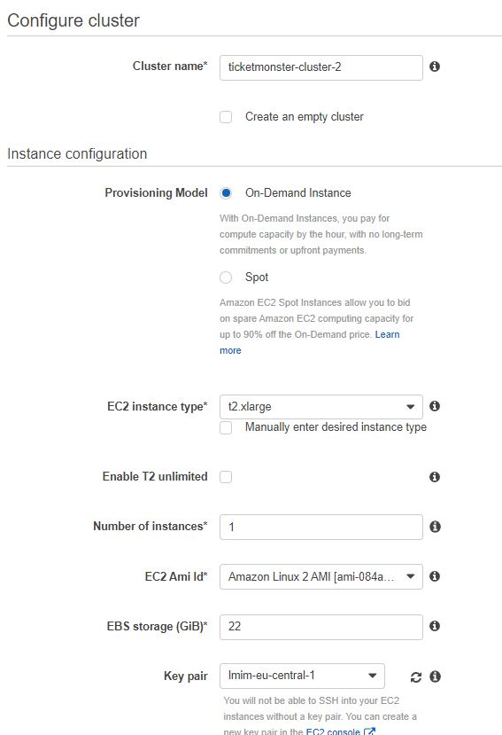
    - *Cluster name:* Enter ticketmonster-cluster.
    - *EC2 instance type:* The default t2.micro instance type will keep you within the free tier. Instance types with more CPU and memory resources can handle more tasks. For more information on the different instance types, see Amazon EC2 Instance Types.
    - *Number of instances:* Leave the default value of 1 to launch one Amazon EC2 instance to launch into your cluster for tasks to be placed on. The more instances you have in your cluster, the more tasks you can place on them.  
    - *Key pair:* A key pair is required to SSH into your instances later on. You can continue by selecting None - unable to SSH, selecting an existing key pair, or by creating one in the Amazon EC2 console. 
1. 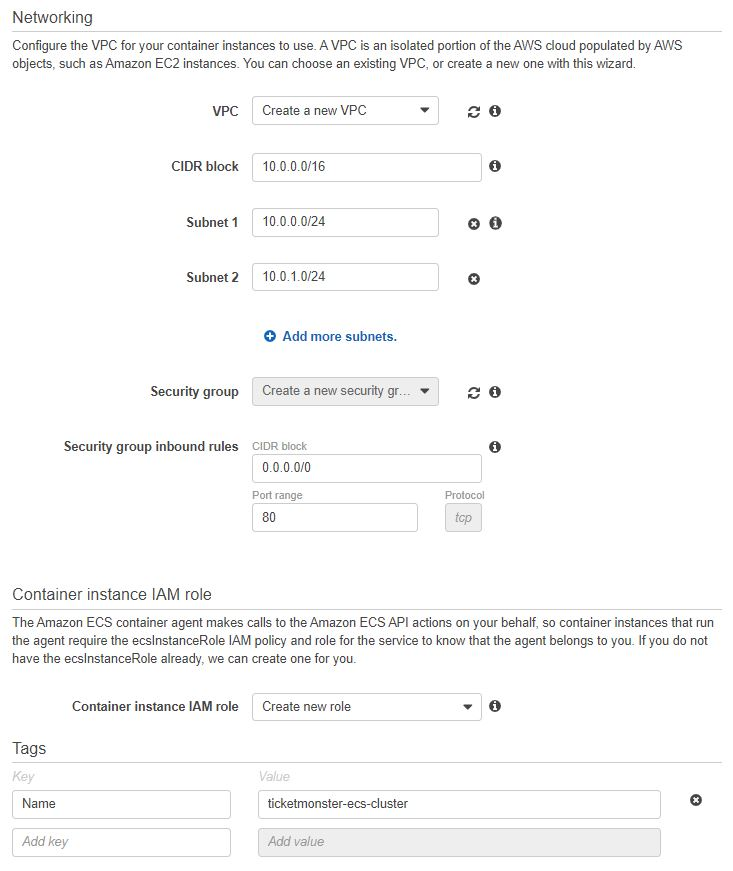
    - *(Optional) Security Group*: The default value (Anywhere) allows access from the entire Internet. You also have the option to choose a CIDR block that restricts access to your instances.
1. Click Create

## Create RDS Database Instance
**Important**
Create a new RDS Instance as we did before but now in your Cluster VPC.

**Wait here and let us create the RDS Instance together**

## Create a task definition

A task definition is like a blueprint for your application. In this step, you will specify a task definition so Amazon ECS knows which Docker image to use for containers, how many containers to use in the task, and the resource allocation for each container.

1. Select EC2 as launch type
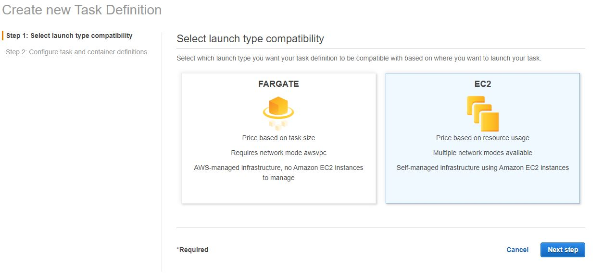
1. Configure task and container definitions
    - *Task Definition Name*: ticketmonster
    - *Task Role*: None
    - *Network Mode*: awsvpc (will allow us to create service security groups)
1. Task execution IAM role
    - (ecsTaskExecutionRole) This role is required by tasks to pull container images and publish container logs to Amazon CloudWatch on your behalf. If you do not have the ecsTaskExecutionRole already, we can create one for you.
1. (Optional) Task size
    - *Task memory (MiB)*: 1024
    - *Task CPU (unit)*: 1 vcpu
1. Container Definitions
    - Click Add container 
    - Standard: 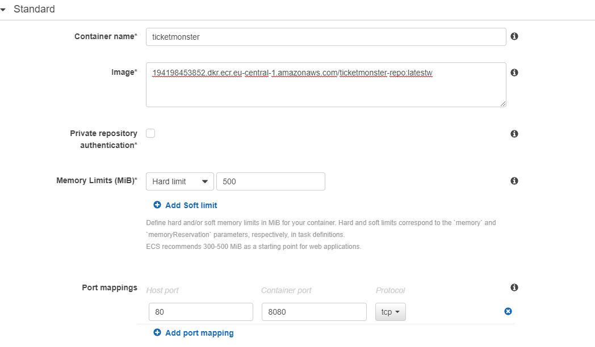
    - Healthcheck: 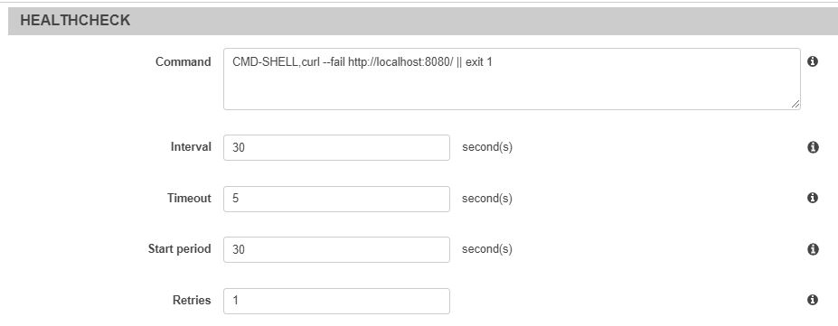
    - Environment: 
    - Storage and Logging: 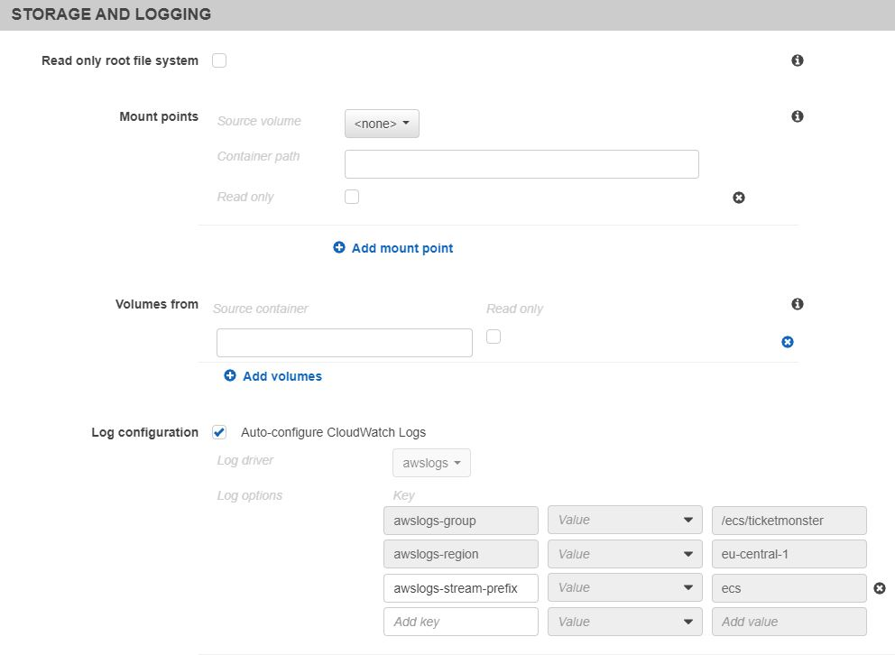
    - Click Add
1. Click Create


## Configure your service

Now that you have created a task definition, you will configure the Amazon ECS service. A service launches and maintains copies of the task definition in your cluster. For example, by running an application as a service, Amazon ECS will auto-recover any stopped tasks and maintain the number of copies you specify.

1. Under Task Definitions select ticketmonster and click Actions -> Create Service 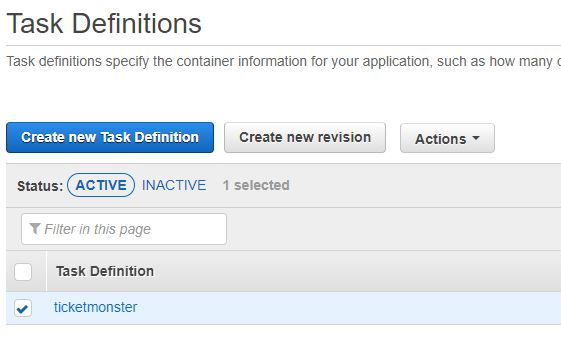
1. Configure service options:
    - 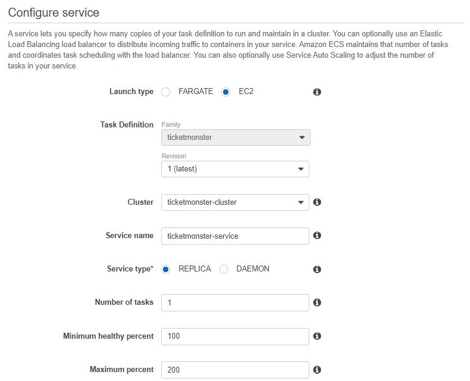
    - *Service Name*: ticketmonster-service
    - *Service Type*: REPLICA Replica services place and maintain a desired number of tasks across your cluster. Daemon services place and maintain one copy of your task on each container instance.
    - *Number of tasks*: 1
1. *Configure network*:
    - Select existing Cluster VPC and all Subnets
    - Security Group:
        - Go to *EC2 Console > Security Groups*
        - Create a new Security Group follow the configuration settings below:
        - 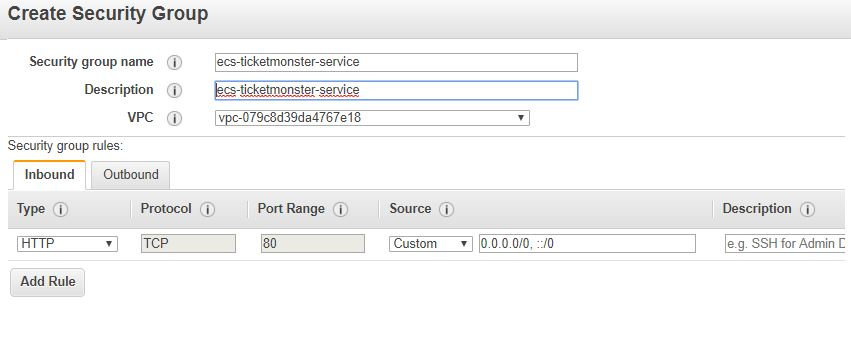
        - Copy the Security Group Id (e.g.: sg-0950df54d6f0ae4ef) and configure your RDS Instance to allow Inbound traffic from this security group
        - 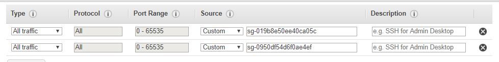
1. *Load balancing*: You have the option to use a load balancer with your service. Amazon ECS can use an Elastic Load Balancing (ELB) load balancer to distribute the traffic across the container instances your task is launched on.
    - **Wait here and let us create the LoadBalancer together**
    - Select Application Load Balancer
    - Under *EC2 Console > Load Balancers" Click *Create Load Balancer*
    - Select Application Load Balancer
    - 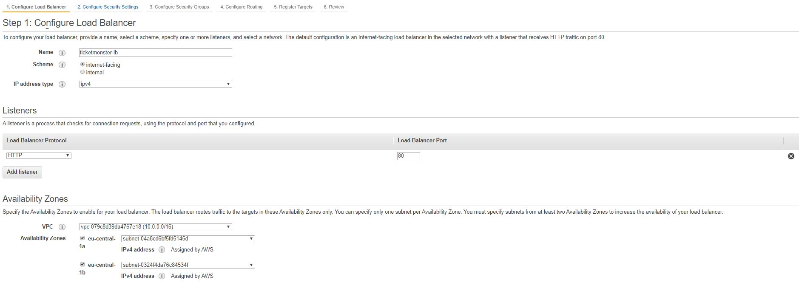
    - 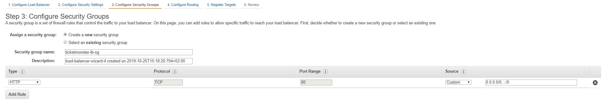
    - 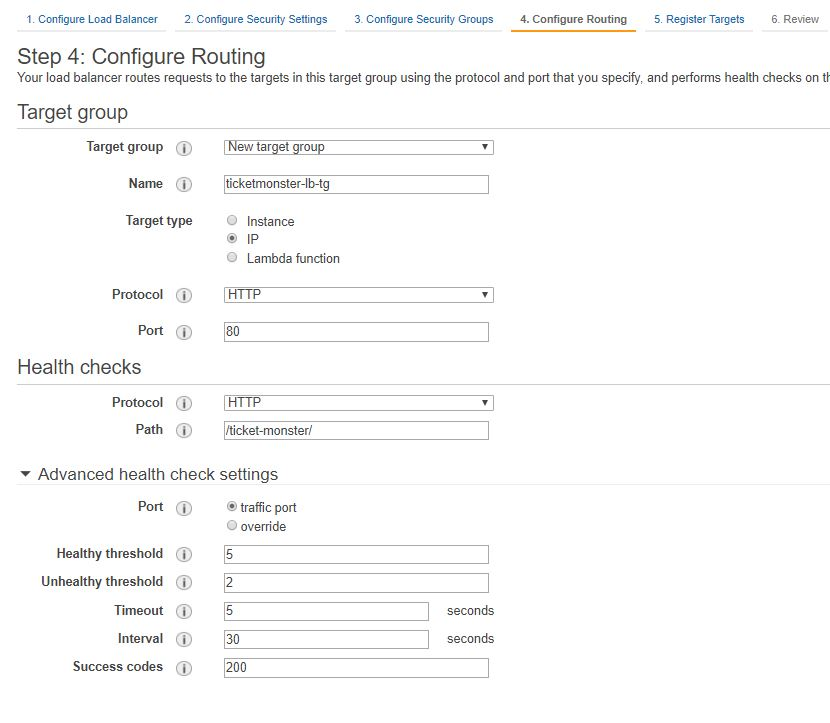
    - Register Targets
        - Do not register targets
    - Now you can select the Loadbalancer in your ECS Service
    - 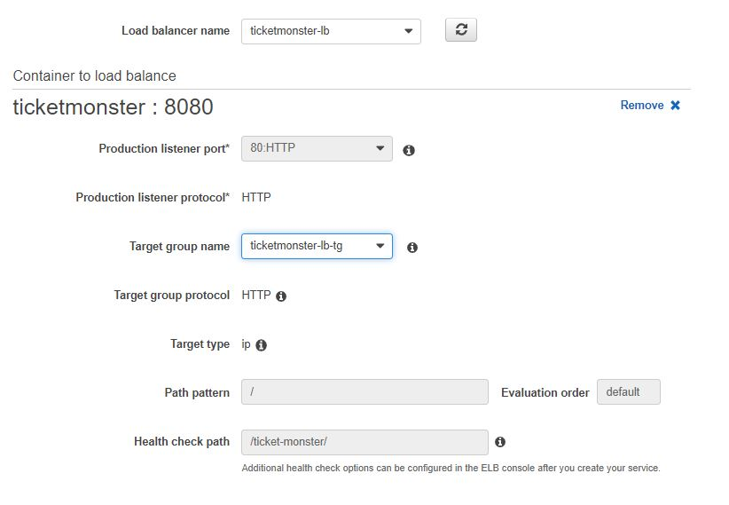
1. Service Discovery
    - Disable service discovery integration
1. Auto Scaling
    - Select *Do not adjust the service’s desired count*

## Open the Application

1. In this step, you will verify that the sample application is up and running by pointing your browser to the load balancer DNS name.

## Simulate Failure

1. SSH into the ECS Instance
1. Find out container id
```bash
docker ps
```
1. Open a bash on the container
```bash
docker exec -it CONTAINER_ID /bin/bash
```
1. Find wildfly process ids and kill them
```bash
ps ax |grep wildfly
kill -9 82
```