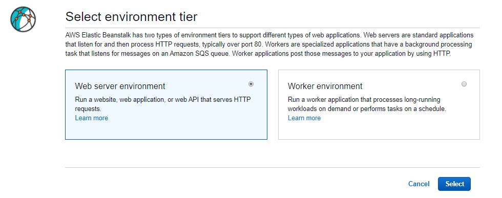
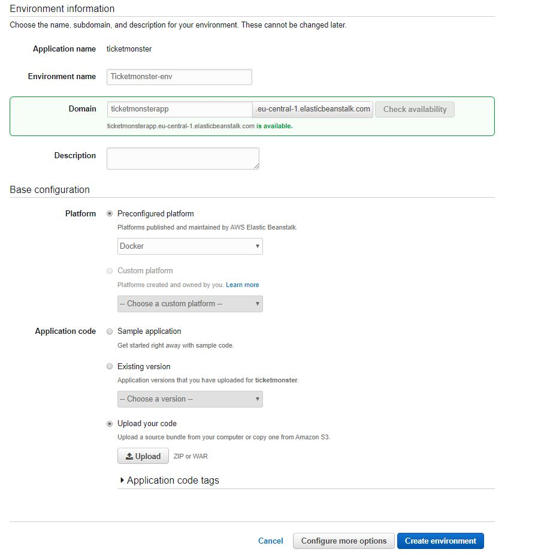
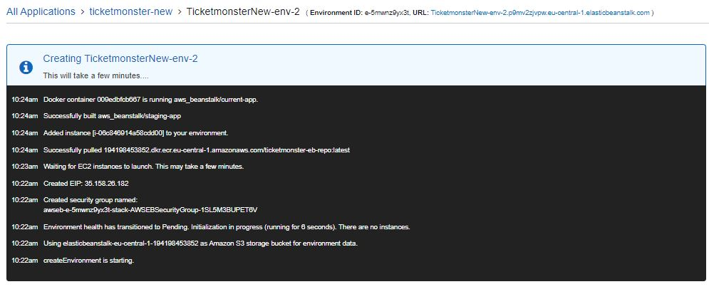
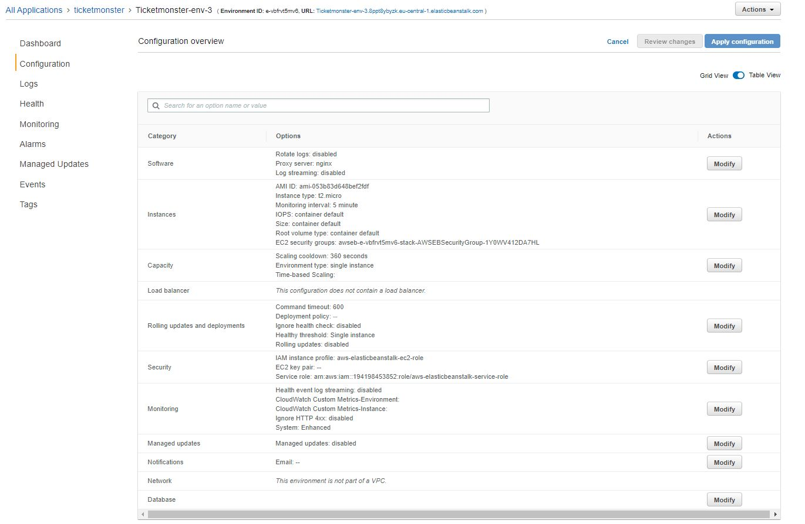
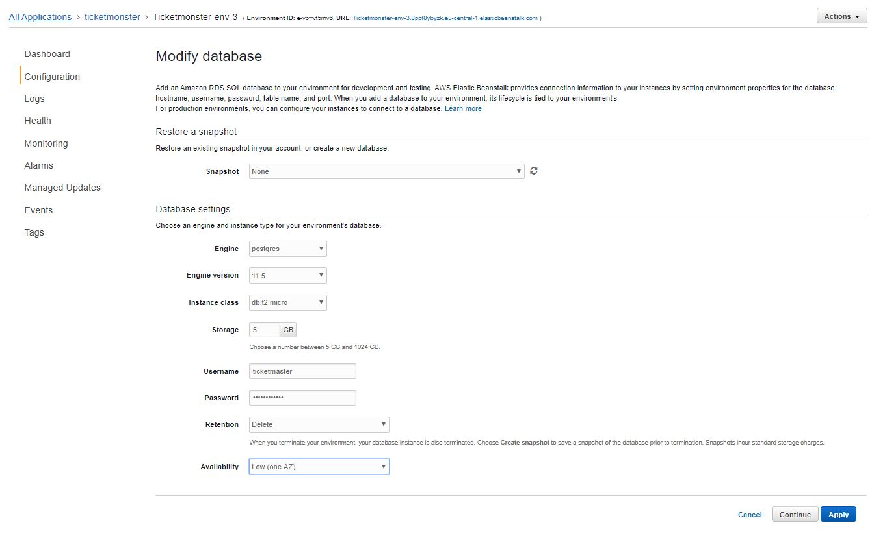

# ElasticBeanstalk
[Working phase 02.02]
### Using Images from an Amazon ECR Repository

**Required steps:**
1. Open the IAM role *aws-elasticbeanstalk-ec2-role*
1. Attach *AmazonEC2ContainerRegistryReadOnly* policy 

<details>
  <summary>More details about this:</summary>

You can store your custom Docker images in AWS with [Amazon Elastic Container Registry](https://aws.amazon.com/ecr) \(Amazon ECR\)\. When you store your Docker images in Amazon ECR, Elastic Beanstalk automatically authenticates to the Amazon ECR registry with your environment's [instance profile](https://docs.aws.amazon.com/elasticbeanstalk/latest/dg/concepts-roles-instance.html), so you don't need to [generate an authentication file](https://docs.aws.amazon.com/elasticbeanstalk/latest/dg/create_deploy_docker.container.console.html#docker-images-private) and upload it to Amazon Simple Storage Service \(Amazon S3\)\.

You do, however, need to provide your instances with permission to access the images in your Amazon ECR repository by adding permissions to your environment's instance profile\. You can attach the [AmazonEC2ContainerRegistryReadOnly](https://docs.aws.amazon.com/AmazonECR/latest/userguide/ecr_managed_policies.html#AmazonEC2ContainerRegistryReadOnly) managed policy to the instance profile to provide read\-only access to all Amazon ECR repositories in your account, or grant access to single repository by using the following template to create a custom policy:

```
{
  "Version": "2012-10-17",
  "Statement": [
    {
      "Sid": "AllowEbAuth",
      "Effect": "Allow",
      "Action": [
        "ecr:GetAuthorizationToken"
      ],
      "Resource": [
        "*"
      ]
    },
    {
      "Sid": "AllowPull",
      "Effect": "Allow",
      "Resource": [
        "arn:aws:ecr:us-east-2:account-id:repository/repository-name"
      ],
      "Action": [
        "ecr:GetAuthorizationToken",
        "ecr:BatchCheckLayerAvailability",
        "ecr:GetDownloadUrlForLayer",
        "ecr:GetRepositoryPolicy",
        "ecr:DescribeRepositories",
        "ecr:ListImages",
        "ecr:BatchGetImage"
      ]
    }
  ]
}
```

Replace the Amazon Resource Name \(ARN\) in the above policy with the ARN of your repository\.
</details>

In your `Dockerrun.aws.json` file, refer to the image by URL\. For the [single container platform](single-container-docker-configuration.md), the URL goes in the `Image` definition:

```
  "Image": {
    "Name": "account-id.dkr.ecr.us-east-2.amazonaws.com/repository-name:latest",
    "Update": "true"
  },
```

## DB in ElasticBeanstalk
Adding a DB instance takes about 10 minutes\. When the environment update is complete, the DB instance's hostname and other connection information are available to your application through the following environment properties:
+ **RDS\_HOSTNAME** – The hostname of the DB instance\.

  Amazon RDS console label – **Endpoint** \(this is the hostname\)
+ **RDS\_PORT** – The port on which the DB instance accepts connections\. The default value varies among DB engines\.

  Amazon RDS console label – **Port**
+ **RDS\_DB\_NAME** – The database name, ebdb\.

  Amazon RDS console label – **DB Name**
+ **RDS\_USERNAME** – The user name that you configured for your database\.

  Amazon RDS console label – **Username**
+ **RDS\_PASSWORD** – The password that you configured for your database\.

## Prepare Docker Image

1. Create an Amazon ECR repository to store your `ticketmonster-eb` image\. Note the `repositoryUri` in the output\.

   ```
   aws ecr create-repository --repository-name ticketmonster-eb-repo --region eu-central-1
   ```

   Output:

   ```json
   {
       "repository": {
           "registryId": "aws_account_id",
           "repositoryName": "ticketmonster-eb-repo",
           "repositoryArn": "arn:aws:ecr:region:aws_account_id:repository/ticketmonster-repo",
           "createdAt": 1505337806.0,
           "repositoryUri": "aws_account_id.dkr.ecr.region.amazonaws.com/ticketmonster-repo"
       }
   }
   ```

1. Run the aws ecr get\-login \-\-no\-include\-email command to get the docker login authentication command string for your registry\. 

   ```bash
   aws ecr get-login --no-include-email --region eu-central-1
   ```

1. Run the docker login command that was returned in the previous step\. This command provides an authorization token that is valid for 12 hours\.

1. Tag the `ticketmonster-eb` image with the `repositoryUri` value from the previous step\.

   ```bash
   docker tag ticketmonster aws_account_id.dkr.ecr.region.amazonaws.com/ticketmonster-eb-repo
   ```

1. Create a new folder and download all required files

```bash
cd ~
mkdir ElasticBeanstalk
cd ElasticBeanstalk
wget https://materialien.s3.eu-central-1.amazonaws.com/workshop/eb/commands.cli
wget https://materialien.s3.eu-central-1.amazonaws.com/workshop/eb/customize.sh
wget https://materialien.s3.eu-central-1.amazonaws.com/workshop/eb/postgresql-9.4-1202.jdbc41.jar
wget https://materialien.s3.eu-central-1.amazonaws.com/workshop/eb/ticket-monster.war
wget https://materialien.s3.eu-central-1.amazonaws.com/workshop/eb/Dockerfile
```
**Wait here and let us talk about the files.**

1. Build Dockerfile
```bash
docker build -t ticketmonster-eb .
```

1. Tag the `ticketmonster` image with the `repositoryUri` value from the previous step\.
```bash
docker tag ticketmonster-eb aws_account_id.dkr.ecr.region.amazonaws.com/ticketmonster-eb-repo
```

1. Push the image to Amazon ECR with the `repositoryUri` value from the earlier step\.
```bash
docker push aws_account_id.dkr.ecr.region.amazonaws.com/ticketmonster-eb-repo
```

1. Review your ECR repositories under e.g.: https://eu-central-1.console.aws.amazon.com/ecr/repositories?region=eu-central-1

1. Adjust the Dockerrun.aws.json file with your ECR Repository

## Create ElasticBeanstalk Environment

1. Inside your application select Actions > Create Environment
1. Select Web server environment
   
1. Configure the following:
    
1. Create a file named Dockerrun.aws.json`
```json
{
    "AWSEBDockerrunVersion": "1",
    "Image": {
      "Name": "194198453852.dkr.ecr.eu-central-1.amazonaws.com/ticketmonster-eb-repo",
      "Update": "true"
    },
    "Ports": [
      {
        "ContainerPort": 8080,
        "HostPort": 8000
      }
    ]
  }
```
**Wait here and let us talk about this.**
1. Upload Dockerrun.aws.json under *Upload your code*
1. Click *Create environment*

The creation may take 5 to 10 minutes.
 

Browse to your application environment URL e.g.: http://TicketmonsterNew-env-2.p9mv2zjvpw.eu-central-1.elasticbeanstalk.com 

http://TicketmonsterNew-env-2.p9mv2zjvpw.eu-central-1.elasticbeanstalk.com/ticket-monster/ shoulld display 404. Since we have no Database in place.

After the environment is created add the required database.

1. Under Configuration select Database and click *Modify*
    
1. Configure as follow:
    
1. Wait for ElasticBeanstalk to update your environment

