# Run on AWS Fargate
[Working phase 03.02]
## Preparation
Task execution role is required for logging and private image pulls for Fargate tasks. Failure to specify the role may lead to task failure or missing logs.
1. Navigate to the IAM Console (https://console.aws.amazon.com/iam/home?region=eu-central-1#/roles)
1. Select Roles and click *Create Role*
1. Select *AWS service*
    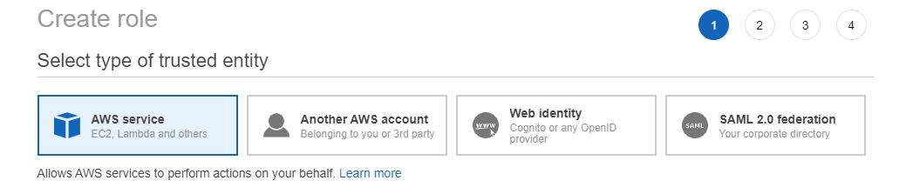
1. Select *Elastic Container Service*
    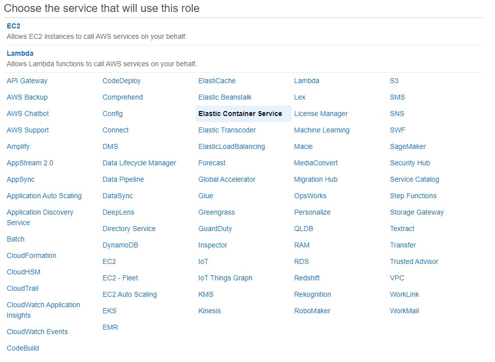
1. Select:
    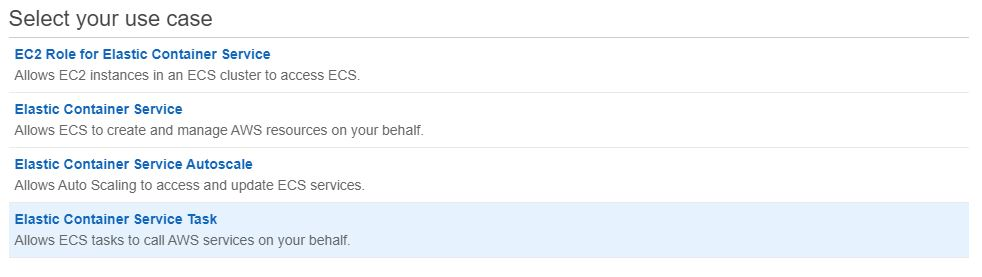
1. Attach *AmazonECSTaskExecutionRolePolicy*
    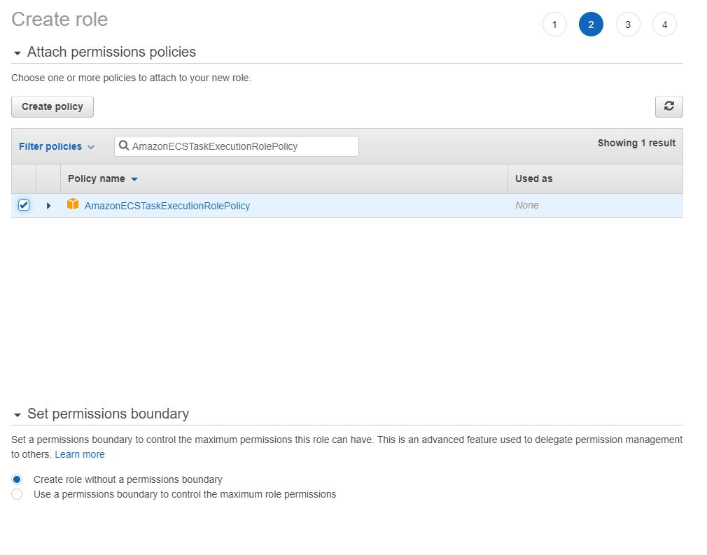
1. Name the role *ecsTaskExecutionRole*
    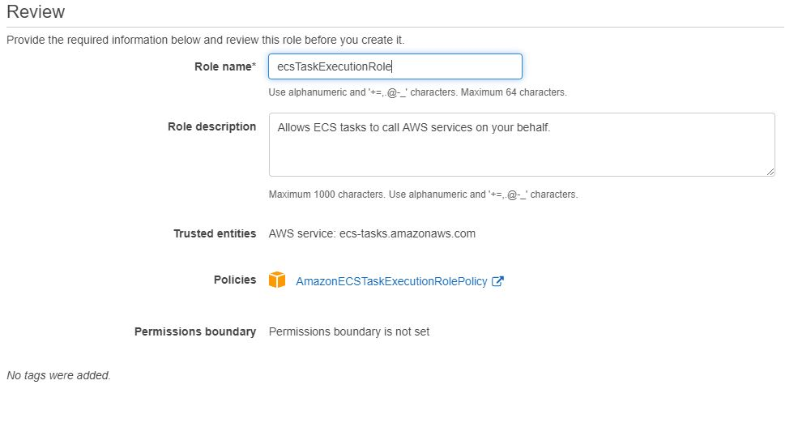

## Adjust Task Definition

1. Open Task Definitions
1. Select the *ticketmonster* Task Definition and create a new revision
1. Change *Requires compatibilities* from EC2 to FARGATE 
1. Under *Task execution IAM role* select the previously created *ecsTaskExecutionRole*
    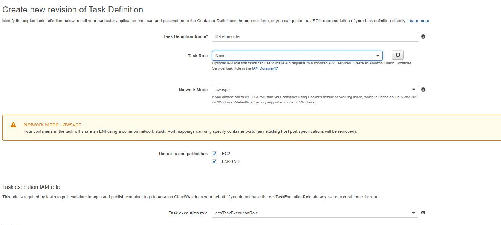
1. Update Task Size and Container Soft limits
    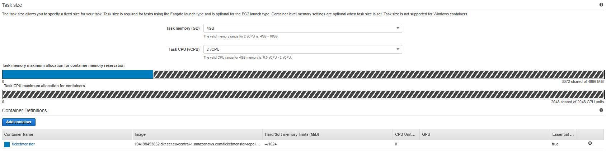
1. Click *Create*

## Create new Service

1. From the previoiusly created Task Defintion revision
1. Select *Actions > Create Service*
    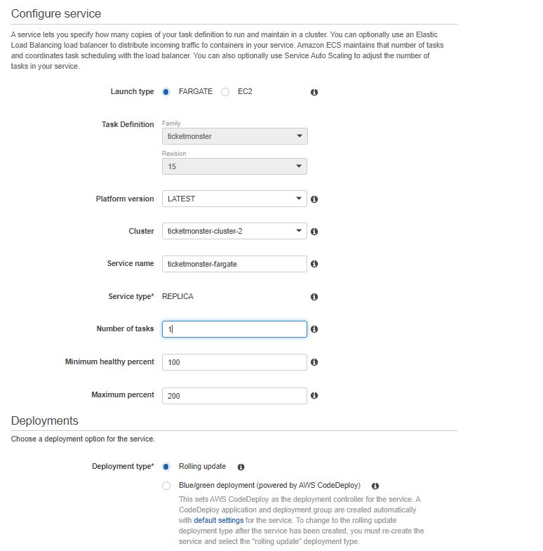
1. Configure network:
    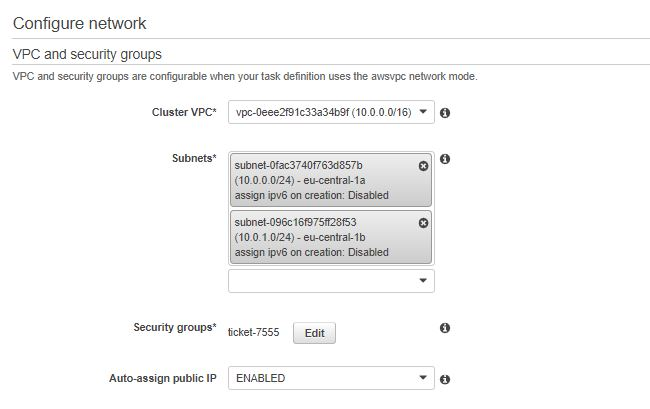
1. Configure Load balancing:
    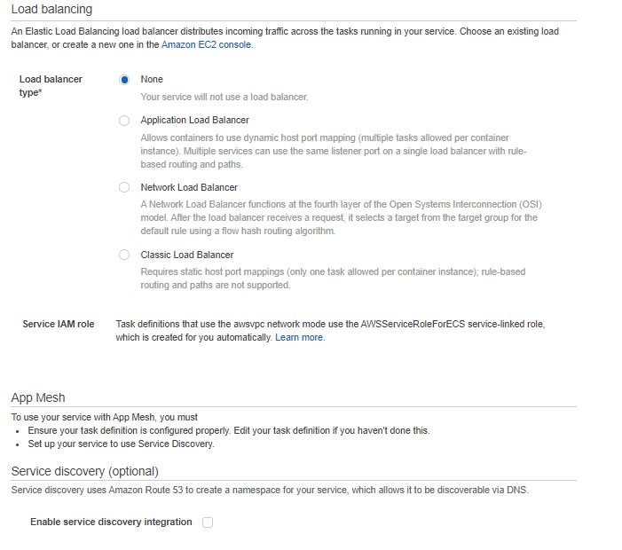
1. And again disable *Service discovery*
1. For now set *Service Auto Scaling* to *Do not adjust the service’s desired count*
1. Adjust the RDS Instance by allowing inbound connectivity from the service security group
1. Adjust the service security group to allow inbound conenctivity on port 8080
    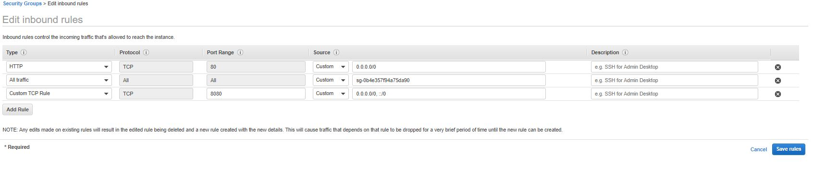
1. Under Tasks select your Fargate Task and navigate your browser to the PublicIP on Port 8080

## Add auto Scaling

1. Inside the ECS Cluster select the *ticketmonster-fargate* service and update the service definition
1. Hit *Next step* until you reach *Service Auto Scaling* Section
    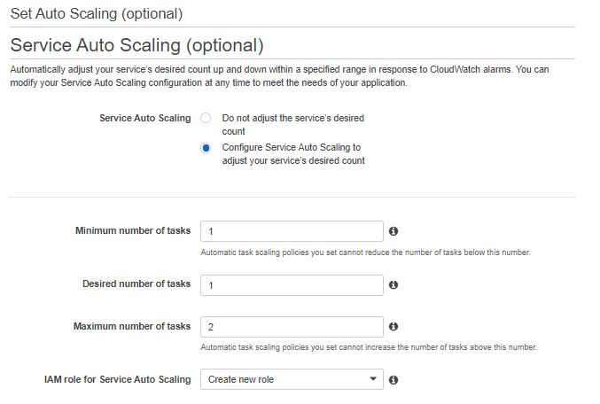
1. Click *Add Auto scaling policy*
    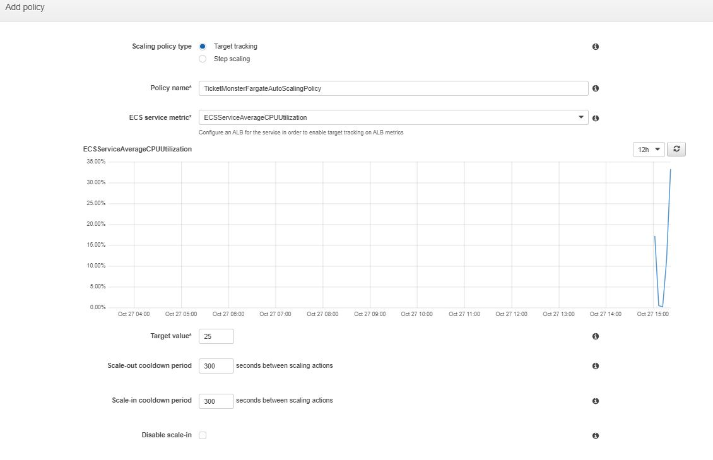
1. Click Save
1. Click Next step and Update the Service
1. Check Metrics under *ECS Cluster > Service > Metrics*
    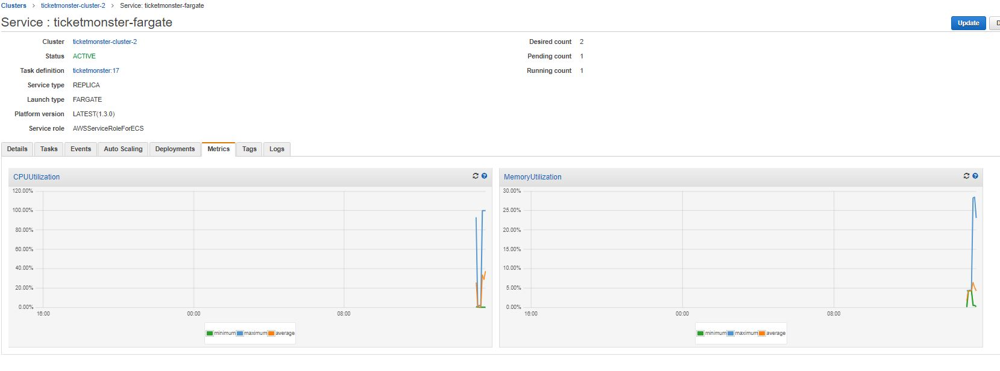
1. Review service events for auto scaling messages
    
