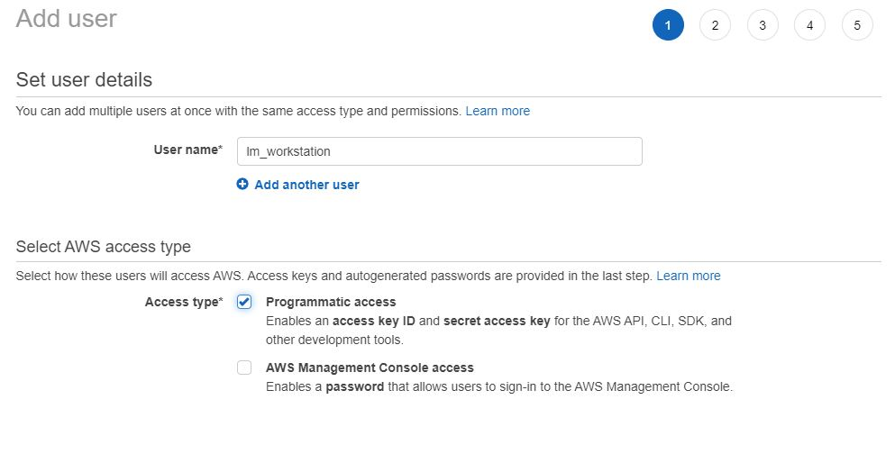
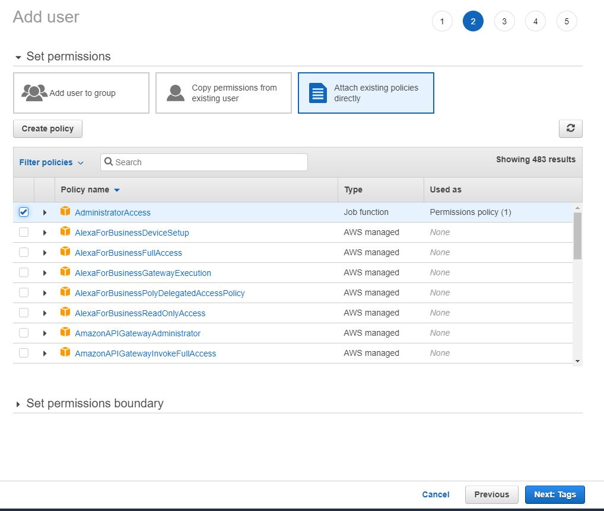
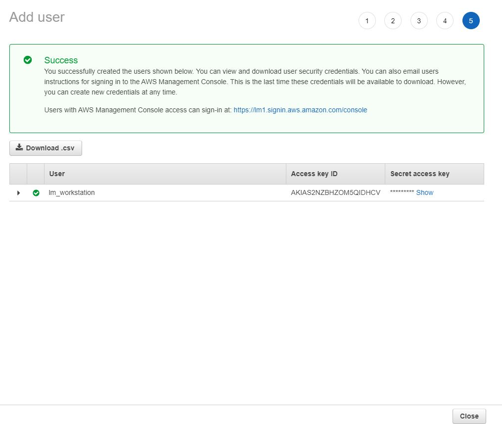
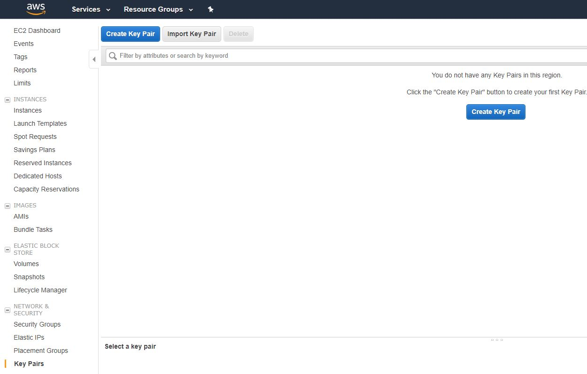
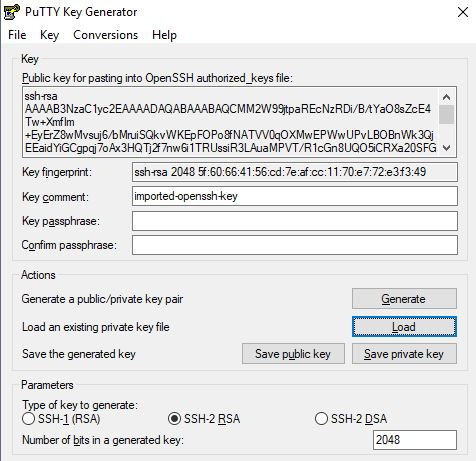

# Preparation

[Working phase 01.01]

1. create IAM user with programmatic access and 
    - assign AdministratorAccess policy
    - store Access key id and Secret access key
    - 
    - 
    - 
1. Install PuTTY
    - https://www.putty.org/
1. create EC2 Key Pair (EC2 Console)
   - 
1. convert from OpenSSH to PuTTY Key
    - open puttygen
    - load previously created private key
    - press save private key to store key in PuTTY Key format
    - 
1. create EC2 Instance
    - e.g.: t2.large / 50 GB / security groups
    - details [Launch an Amazon EC2 Instance](https://docs.aws.amazon.com/quickstarts/latest/vmlaunch/step-1-launch-instance.html)
1. connect using PuTTY
1. configure AWS CLI
    - [Install AWS CLI (Command Line Interface)](https://aws.amazon.com/cli/?nc1=h_ls)
    - either on the local computer or on the previously created aws instance
        ```bash
        aws configure
        ```
    - Enter Access Key Id, Secret access key and set default region to eu-central-1