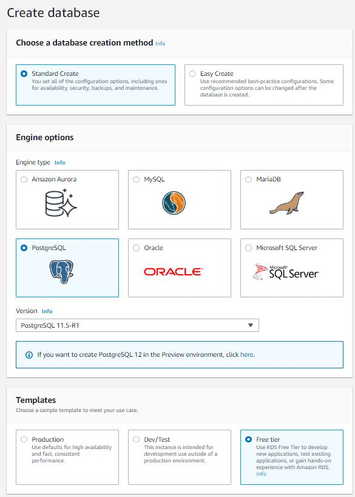
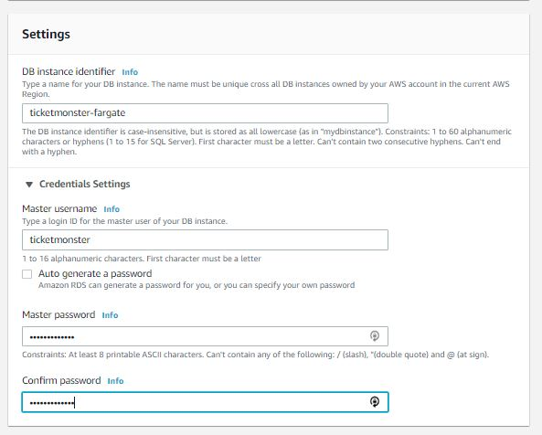
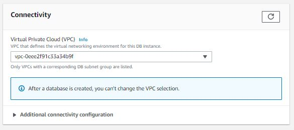
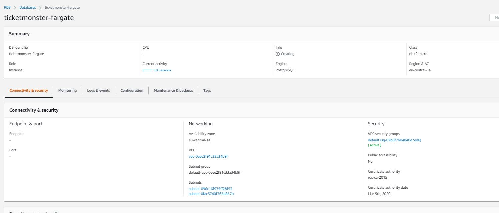

# Create RDS Database Instance
1. Navigate to the RDS Console
    
    
1. Leave everything default, (For ECS it's just important that you select the ECS VPC under *Connectivity*)
    
1. Hit create database

## Adjust security group
1. Open your RDS Instance
1. Under *Security* hit the link to the VPC security group
    
1. Add the required Inbound Rules