# Serverless API Development
## Create an Amazon DynamoDB Table
1. From the AWS Management Console, choose **Services** then select **DynamoDB** under Databases.
1. Choose **Create table**.
1. Enter **Events** for the Table name. This field is case sensitive.
1. Enter **EventId** for the Partition key and select String for the key type. This field is case sensitive.
1. Check the **Use default settings box** and choose Create.
    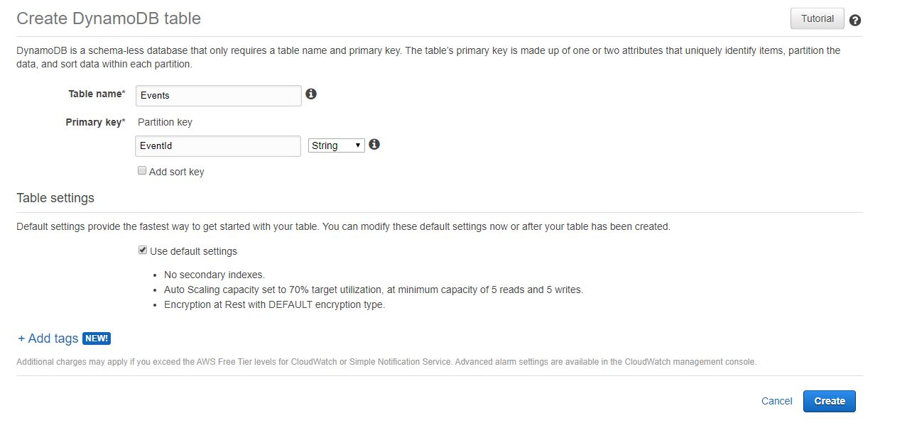
1. Scroll to the bottom of the Overview section of your new table and note the ARN. You will use this in the next section.
    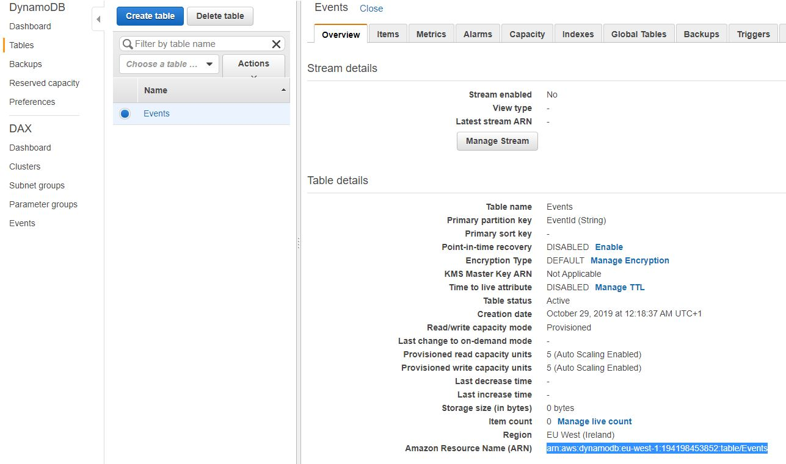

## Create an IAM Role for Your Lambda function
Every Lambda function has an IAM role associated with it. This role defines what other AWS services the function is allowed to interact with. You'll need to create an IAM role that grants your Lambda function permission to write logs to Amazon CloudWatch Logs and access to write items to your DynamoDB table.

1. Open the **IAM Console**
1. Select **Roles** in the left navigation bar and then choose **Create New Role**.
1. Select Lambda for the role type from the AWS service group, then click Next
    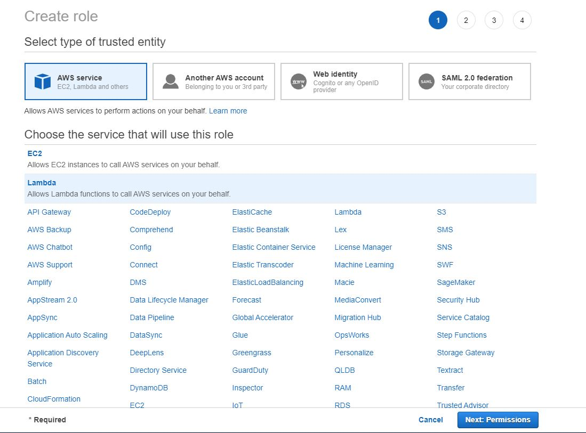
1. Attach *AWSLambdaBasicExecutionRole*
1. Press next and name the Role **EventsLambdaRole** then press create Role
    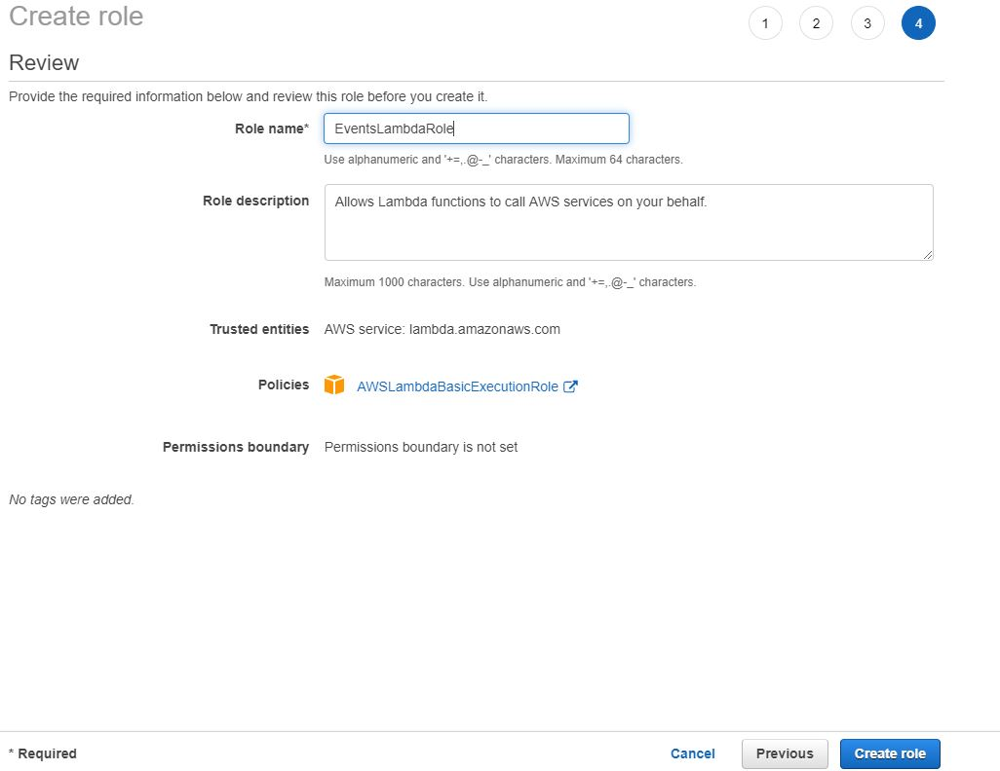
1. Reopen the created Role and Press *Add inline policy*
1. Select *DynamoDB* as a service and select *PutItem*  under Access level > Write
    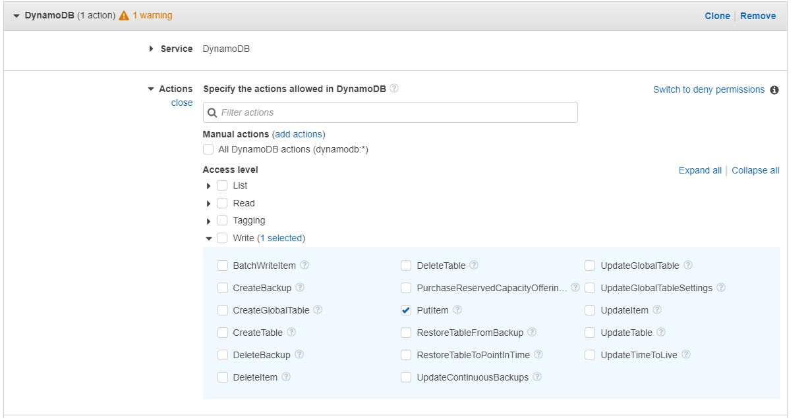
1. Under Resources specifie the before created table arn (e.g.: arn:aws:dynamodb:eu-west-1:194198453852:table/Events)
    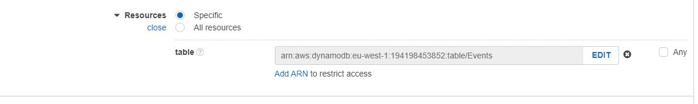
1. Now click *Review policy* enter the name **EventsDynamoDBWriteAccess** and *Create Policy*

## Create your Lambda function

1. Open the **AWS Lambda Console**
1. Click **Create function**
1. Keep the default **Author from scratch** card selected.
1. Enter **RequestEvent** in the name field
1. Select **Node.js 10.x** as Runtime
1. Select **Use an existing role** and specify the previously created **EventsLambdaRole**
    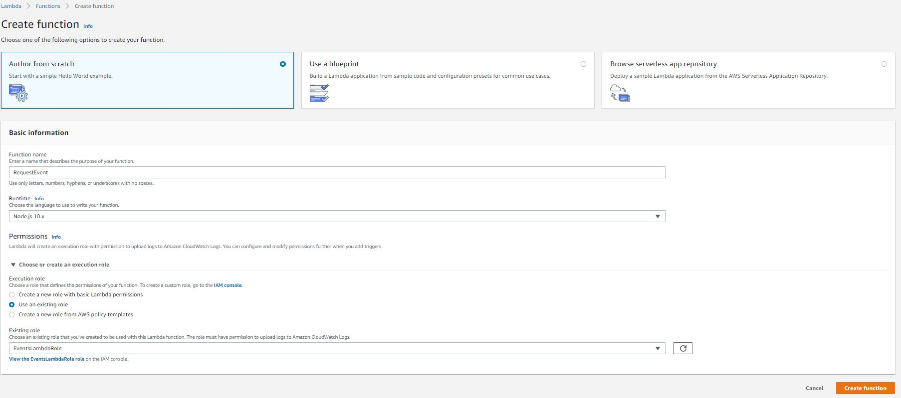
1. Hit **Create function**
1. Scroll down to the Function code section and replace the exiting code in the index.js code editor with the contents of

```js
const randomBytes = require('crypto').randomBytes;
const AWS = require('aws-sdk');
const ddb = new AWS.DynamoDB.DocumentClient();

exports.handler = async (event) => {
    const eventId = toUrlString(randomBytes(16));
    
    console.log('Received event (', eventId, '): ', event);
    
    const requestBody = JSON.parse(event.body);
    
    await ddb.put({
        TableName: 'Events',
        Item: {
            EventId: eventId,
            RequestTime: new Date().toISOString(),
            requestBody
        }
    }).promise();
    
    
    const response = {
        statusCode: 200,
        body: JSON.stringify({eventId}),
    };
    return response;
};

function toUrlString(buffer) {
    return buffer.toString('base64')
        .replace(/\+/g, '-')
        .replace(/\//g, '_')
        .replace(/=/g, '');
}
```

1. Click save

### Test
1. Click **Configure test event** from the the **Select a test event...** dropdown.
1. Enter **RequestTest** in the Event name field
1. Copy and paste the following test event into the editor:

```json
{
    "path": "/event",
    "httpMethod": "POST",
    "headers": {
        "Accept": "*/*",
        "Authorization": "eyJraWQiOiJLTzRVMWZs",
        "content-type": "application/json; charset=UTF-8"
    },
    "queryStringParameters": null,
    "pathParameters": null,
    "body": "{\"eventName\":\"MyEvent\"}"
}
```

1. Execute the test
1. Review outcome and items in DynamoDB

## Create a New REST API
1. In the AWS Management Console, click *Services* then select *API Gateway* under Application Services.
1. Choose *Create API*
1. Select New API and enter *EventsApi* for the API Name.
    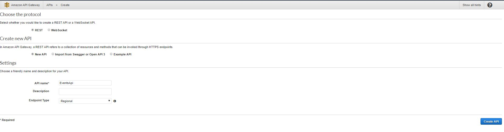
1. Click *Create API*

### Create a new resource and method
1. In the left nav, click on *Resources* under your EventsApi API.
1. From the *Actions* dropdown select *Create Resource*.
1. Enter *event* as the Resource Name
    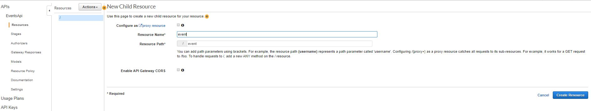
1. Click *Create Resource*
1. From the *Action* dropdown select *Create Method*.
1. Select **POST**
   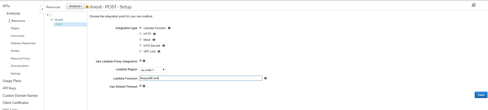
1. Click *Save*

### Deploy Api
1. In the *Actions* drop-down list select *Deploy API*.
1. Select [New Stage] in the Deployment stage drop-down list.
1. Enter *prod* for the Stage Name.
1. Choose Deploy.
1. Note the Invoke URL. 

### Test Using Curl or Postman
- 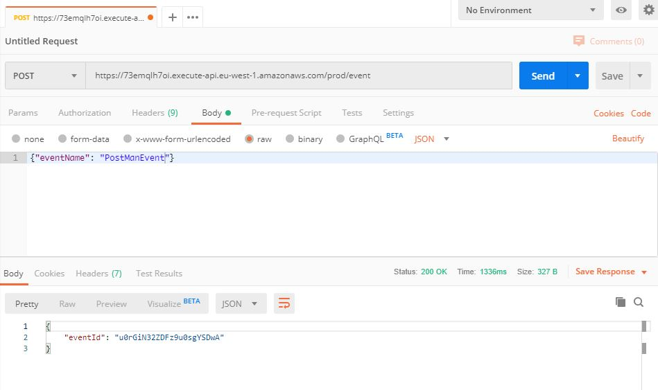
- 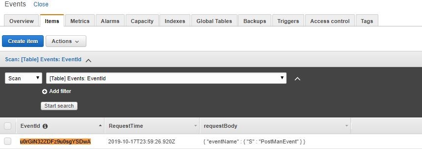
